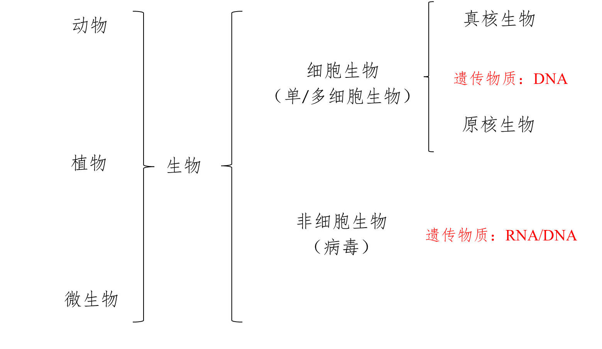

## 细胞学说

### 建立过程

=== "解剖/观察"
    - 维萨里: 器官
    - 比夏: 组织

=== "显微镜(技术)"
    - 罗伯特·胡克: 命名细胞(观察死细胞)
    - 列文虎克: 活细胞

=== "观察/归纳概括"
    - 施莱登
    - 施旺
    - 魏尔肖: 细胞通过分裂产生新细胞(**所有的细胞都来源于先前存在的细胞**)

??? note "归纳法"
    - 完全归纳
    - 不完全归纳

### 内容

!!! tip ""
    建立者: 施莱登/施旺

1. 细胞是一个有机体,一切**动植物**都由细胞发育而来,并由细胞和细胞产物所构成
2. 细胞是一个**相对**独立的单位,既有它自己的生命,又对与其他细胞共同组成的整体生命起作用
3. 新细胞是由老细胞分裂产生的

### 意义

- 动植物的统一性 $\Longrightarrow$ 生物界的统一性
- 标志着生物学进入细胞水平

## 生物分类

### 病毒

#### 组成

蛋白质 / 核酸

#### 生活方式

寄生

#### 种类

- 按宿主分: 动物病毒/植物病毒/噬菌体
- 按遗传物质分: 
    * DNA病毒: 噬菌体/乙肝病毒
    * RNA病毒: 烟草花叶病毒/HIV/各种流感病毒(如SARS/新冠病毒等)

### 单细胞生物

依赖单个细胞维持各项生命活动

### 多细胞生物

依赖各种分化的细胞密切合作共同完成生命活动

- 与环境物质和能量交换基础: 细胞代谢
- 生物生长发育基础: 细胞增殖/分化
- 遗传变异基础: 细胞内基因的传递与变化

## 生命系统的层次

细胞 $\rightarrow$ 组织 $\rightarrow$ 器官 $\rightarrow$ 系统 $\rightarrow$ 个体 $\rightarrow$ 种群 $\rightarrow$ 群落 $\rightarrow$ 生态系统 $\rightarrow$ 生物圈

1. 植物没有系统
2. 