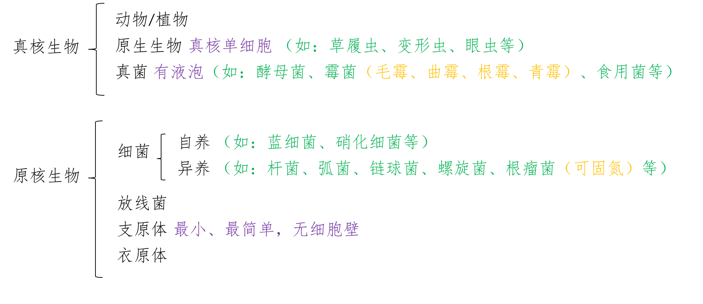

## 显微镜

### 分类

- 光学显微镜 (显微结构)
- 电子显微镜 (亚显微结构)

### 使用方法

<iframe height=421 width=750 src="//player.bilibili.com/player.html?aid=540468312&bvid=BV1Ri4y1t7NB&cid=181892839&page=1" scrolling="no" border="0" frameborder="no" framespacing="0" allowfullscreen="true"> </iframe>

## 真核细胞 原核细胞

### 划分依据

细胞内有无以核膜为界限的细胞核

### 分类

