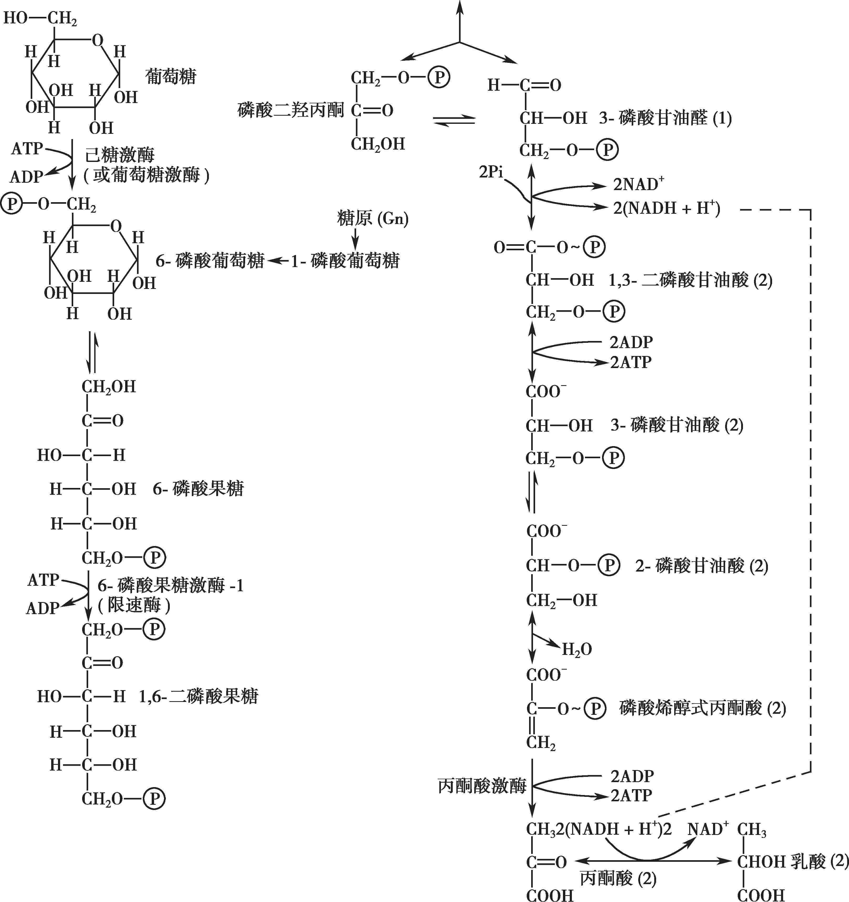
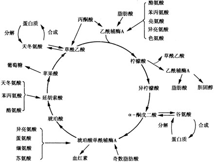

!!! note "拓展"

    1. **[糖酵解](https://baike.baidu.com/item/%E7%B3%96%E9%85%B5%E8%A7%A3/437075?fr=ge_ala)**
    
        ??? inline end info "过程"
            

        葡萄糖分子经过十多步酶催化的反应,分裂为两分子丙酮酸(第一个不再磷酸化的化合物).大多数情况下,它可以通过氧化脱羧形成乙酰辅酶A(乙酰CoA),也可形成乙醇,乳酸和甘油等.

    2. **[三羧酸循环](https://baike.baidu.com/item/%E4%B8%89%E7%BE%A7%E9%85%B8%E5%BE%AA%E7%8E%AF/437762?fr=aladdin)**

        ??? inline end info "过程"
            
        
        三羧酸循环(TCA循环)是需氧生物体内普遍存在的代谢途径.原核生物中分布于细胞质，真核生物中分布在线粒体.三羧酸循环是三大营养素(糖类 / 脂类 / 氨基酸)的最终代谢通路,又是三者代谢联系的枢纽.

    3. **[电子传递链](https://baike.baidu.com/item/%E5%91%BC%E5%90%B8%E9%93%BE?fromModule=lemma_inlink)**