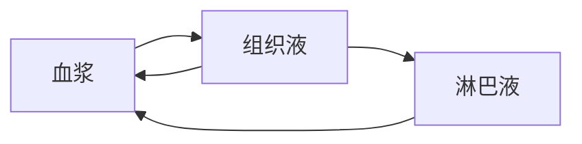
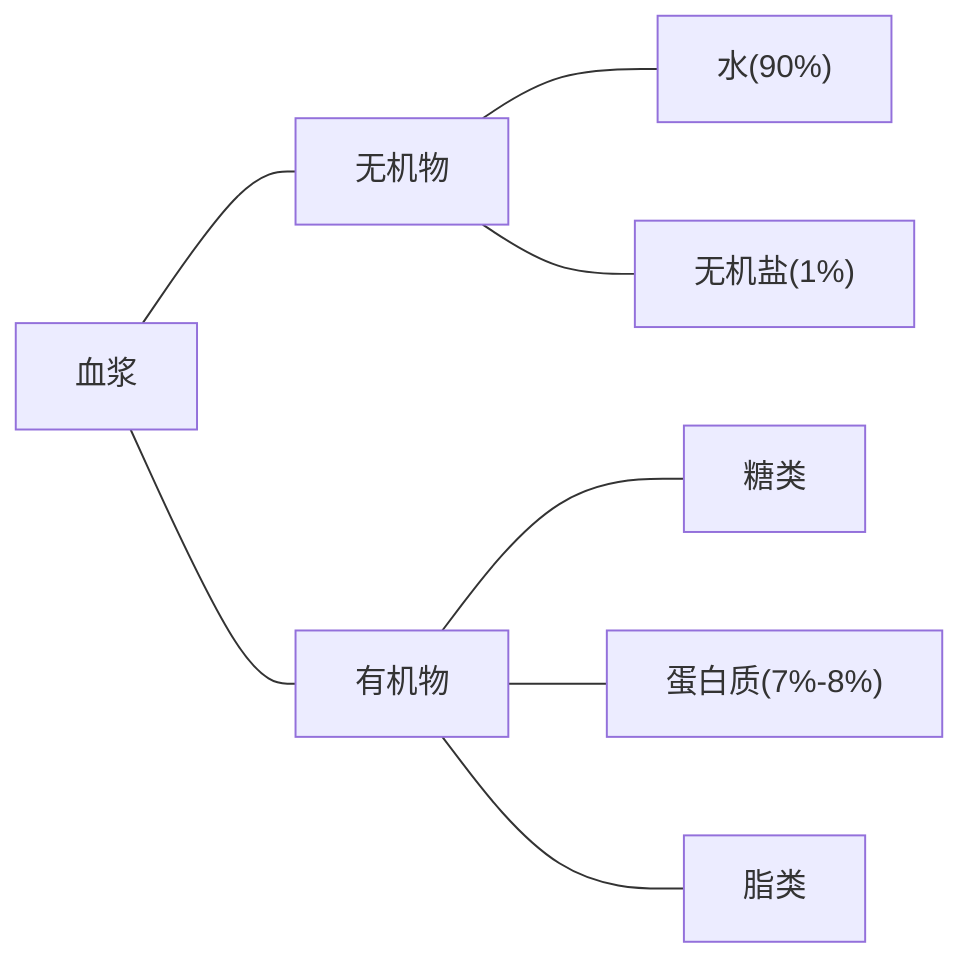
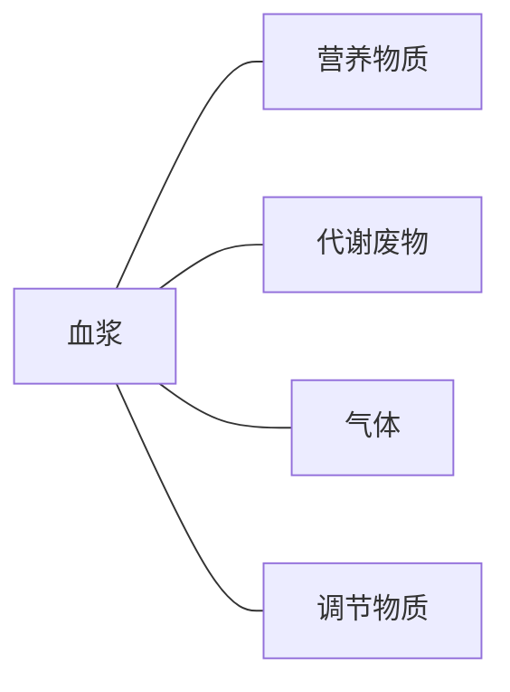
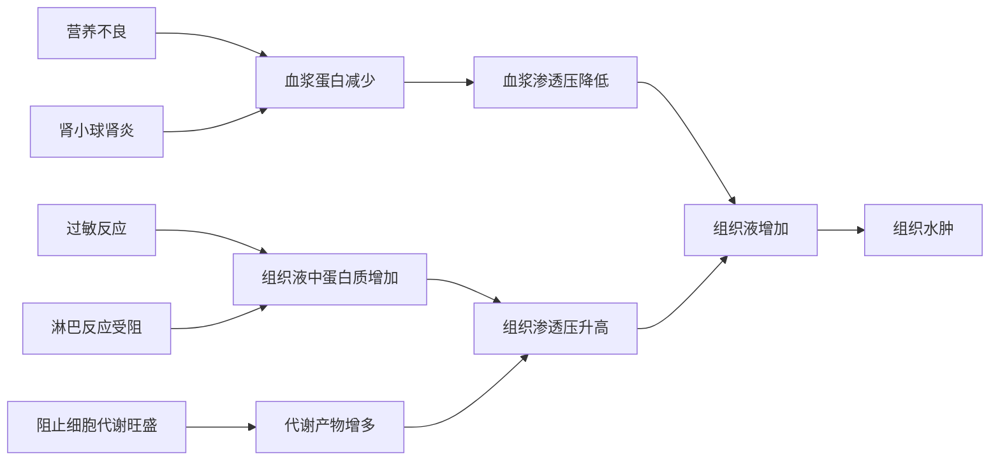

## 体内细胞生活在细胞外液中

### 体液

生物体内以水为基础的液体(此处还应有*图1-1 细胞外液的内在联系*)

### 血浆 

血液的主要成分 血细胞直接生活的环境

!!!note "注"
    血清+某蛋白=血浆

    血浆+血细胞=血液

### 组织液

存在与组织间隙的液体 又名组织间隙液

是体内绝大多数细胞直接生活的环境

### 淋巴液 

淋巴细胞 组织细胞直接生活的环境

### 几种细胞直接生活环境

| 细胞             | 生活环境    |
| :--------------: | :----------: |
| 组织细胞          | 组织液  |
| 血细胞            | 血浆 |
| 淋巴细胞          | 血浆/淋巴液 |
| 毛细血管壁细胞    | 组织液/血浆 |
| 毛细淋巴管壁细胞  | 组织液/淋巴液 |

### 内环境

细胞外液构成的液体环境

细胞(内液)<内环境(外液)<外环境

## 细胞外液的成分

!!!note ""
    组织液/细胞液成分与之类似 仅蛋白质含量相对较少

???warning "不是内环境成分的物质"
    - 存在于细胞内/细胞膜上的物质 *(如血红蛋白/呼吸酶等)*

    - 存在于与外界相通的管/腔中的物质

    - 不能被人体吸收的物质 *(如蔗糖)*

    !!!danger "" 
        注意物质出现的位置

???+tip "某些物质穿过膜层数问题"
    - $O_2$ (自由扩散)从外界环境到被组织利用,至少需穿过**11**层生物膜
    !!!note ""
        肺泡壁(2)->毛细血管壁(2)->红细胞(1+1)->毛细血管壁(2)->组织细胞(1)->线粒体(2)
    - 葡萄糖(主动运输)从外界环境(小肠)到被组织利用,至少需穿过**7**层生物膜
    !!!note ""
        肠腔(2)->毛细血管壁(2+2)->组织细胞(1)
    !!!warning "注意"
        生物膜 or 磷脂双分子层

## 细胞外液的理化性质

### 渗透压

1.定义: 溶液中溶质微粒对水的吸引力

2.决定因素: 单位体积内溶质微粒数目
???+tip "提示"
    单位体积内溶质微粒数增加,吸水能力增加

    **只比较微粒数目,与微粒大小/种类无关**
???note "与生活的联系"
    生理盐水: $0.9\% NaCl(\text{aq})$

3.组织水肿 

不同条件下,细胞外液渗透压变化,引起组织间隙中积累的组织液过多导致组织液水肿

### 酸碱度(pH)

1.正常人 $7.35 \sim 7.45$

2.维持:缓冲对
!!!note ""
      - $HCO_3^-/H_2CO_3$
      - $HPO_4^{2-}/H_2PO_4^-$
???+tip "提示"
    血浆缓冲作用需在呼吸/排泄系统配合下进行

### 温度

37℃左右

## 细胞通过内环境与外界环境进行物质交换

内环境是细胞与外界环境进行物质交换的媒介