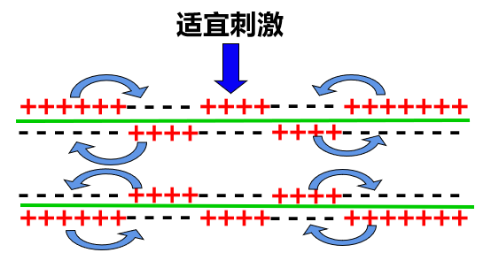

## 兴奋在神经纤维上的传导

??? note "图2-5 神经表面电位差"
    

!!!tip ""
    神经系统中,兴奋是以电信号(神经冲动)的形式沿神经纤维传导的

!!! example "钠钾泵"
    !!! question ""
        $Na^+$ 浓度膜外更高, $K^+$ 浓度膜内更高
    - 钠钾泵:消耗一个 $ATP$ 分子,逆电化学梯度泵出 $3$ 个 $Na^+$ ,泵入 $2$ 个 $K^+$
    
    $$
    \begin{aligned}
        c(Na^+)_{\text{外}}&=12c(Na^+)_{\text{内}}\\
        30c(K^+)_{\text{外}}&=c(K^+)_{\text{内}}
    \end{aligned}
    $$

=== "静息电位"

    静息时,膜对 $K^+$ 的通透性大, $K^+$ 外流
    - 内负外正(协助扩散)

=== "动作电位"

    受刺激时,膜对 $Na^+$ 的通透性大, $Na^+$ 内流
    - 外负内正

!!! note inline end "图2-6 静息/动作电位"
    

### 形式

电信号

### 局部电流方向

=== "膜内"

    从兴奋部位到未兴奋部位,与兴奋传导方向相同

=== "膜外"

    从未兴奋部位到兴奋部位,与兴奋传导方向相反

!!! note inline end "图2-7 兴奋的传导"
    

### 特点

=== "离体神经纤维"

    双向传导

=== "生物体内"

    单向传导

### 膜电位变化曲线

!!! note inline end "图2-8 膜电位变化曲线"
    

- $AB$ 段: 静息电位( $K^+$ 外流,协助扩散)
- $BC$ 段: 动作电位形成( $Na^+$ 内流,协助扩散)
- $CD$ 段: 恢复静息电位( $K^+$ 外流,协助扩散)
- $DE$ 段: 兴奋完成,钠钾泵将 $Na+$ 泵出, $K^+$ 泵入,为下次兴奋准备(吸 $K^+$ 排 $Na^+$ ,主动运输)

## 兴奋在神经元之间的传递

### 突触小体

神经元轴突末梢经过多次分支,最后每个小枝末端膨大,成杯状或球状,叫做突触小体

### 突触

- 轴突-树突形
- 轴突-细胞体({++**肌肉细胞/腺体细胞**++})形

### 突触的组成

=== "突触前膜"

    突触前神经元轴突末梢的膜,还可以说是突触小体的膜

=== "突触间隙"

    突触间隙中充满了组织液

=== "突触后膜"

    一般为突触后神经元树突或细胞体的膜,在效应器的突触中,也可能为腺细胞膜或某些肌肉细胞的膜

### 兴奋通过突触的传递过程

1. 突触前膜释放神经递质
2. 神经递质通过突触间隙扩散到突触后膜的受体附近
3. 形成递质-受体复合物
4. 突触后膜上的离子通道发生变化,引发电位变化
5. 神经递质被降解或回收

### 神经递质

#### 种类

!!! tip inline end "常见神经递质"
    - 乙酰胆碱
    - 氨基酸(如谷氨酸/甘氨酸)
    - 5-羟色氨
    - 多巴胺
    - 去甲肾上腺素
    - 肾上腺素

=== "兴奋型"

    ( $Na^+$ 内流)
    如 乙酰胆碱

=== "抑制型"

    ( $Cl^-$ 内流)
    如 甘氨酸

#### 释放方式

胞吐

#### 产生

与高尔基体有关

#### 作用

引起下一个神经元兴奋或抑制

#### 去向

- 被相应酶降解
- 被突触前膜回收

### 特点

=== "单向传递"

    !!! quote "「考试常考」"
        神经递质只存在于突触小泡中,只能由突触前膜释放,然后作用于突触后膜上

=== "突触延搁"

    !!! quote "「似乎也考」"
        突触处的兴奋传递需要通过化学信号的转换

### 传递形式

- 突触处: 电信号-->化学信号-->电信号
- 突触前膜处: 电信号-->化学信号
- 突触后膜处: 化学信号-->电信号

## 滥用兴奋剂与吸食毒品的危害

### 某些化学物质对神经系统的影响

某些化学物质能够对神经系统产生影响,其作用位点往往是突触

- 有些物质能够促进神经递质的合成和释放的速率
- 有些会干扰神经递质与受体的结合
- 有些会影响分解神经递质的酶的活性

### 兴奋剂

原指能提高中枢神经系统机能活动的一类药物,如今是运动禁用药物的统称

兴奋剂具有增强人的兴奋程度,提高运动速度等作用

> 为了保证公平/公正,运动比赛禁止使用兴奋剂.

### 毒品

指 鸦片/海洛因/甲基苯丙胺(冰毒)/吗啡/大麻/可卡因 以及国家规定管制的其他能够使人形成瘾癖的麻醉药品和精神药品

!!! warning "注意"
    有些兴奋剂就是毒品，它们会对人体健康带来极大的危害

