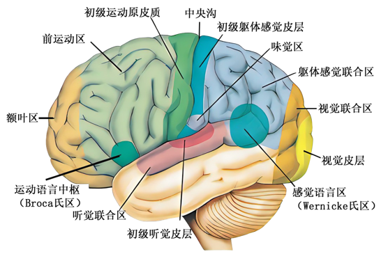
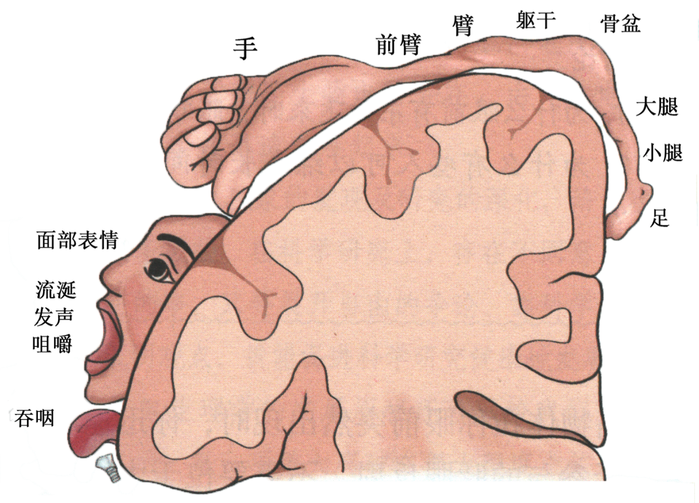

## 神经系统对 躯体运动 的分级调节

### 大脑的结构

!!! note inline end "图2-11 脑子"
    

=== "白质"

    - 位置: 大脑皮层以内
    - 组成: 神经纤维
    - 功能: 将两个大脑半球以及 小脑/脑干/脊髓 巧妙地联系起来

=== "大脑皮层(灰质)"

    - 位置: 覆盖大脑表面
    - 组成: 由神经元胞体及其树突构成的薄层结构
    - 结构: 有丰富的沟回
    - 功能: 大脑通过脑干与脊髓相连,大脑发出的指令,可以通过脑干传到脊髓。

### 大脑皮层的功能分区

!!! note inline end "图2-12 第一运动区 纵剖面"
    

!!! example "研究方法"
    - 损伤
    - 电刺激
    - 影像学习


### 大脑皮层和躯体运动的关系

除面部以外的区域: 上下交叉,左右相反

!!! success "正确言论"
    运动越精细,大脑皮层代表的范围越大

???+ note "图2-13 躯体运动的分级调节 流程图"
    ``` mermaid 
    graph LR
    A[感受器] -- 传入神经 --> B["脊髓(低级神经中枢)"]
    B --> C["脑(高级神经中枢)"]
    C --> B
    B -- 传出神经 --> D[效应器]
    ```

??? note "图2-14 躯体运动的分级调节 示意图"
    ``` mermaid
    graph TB
    A["大脑皮层(运动区)"] --> B["小脑/脑干"]
    B --> C["脊髓"]
    A --> C
    C --> D["肌肉收缩等运动"]
    ```

## 神经系统对 内脏活动 的分级调节

( *e.g.* 排尿反射的分级调节)

膀胱(自主神经系统)

- 交感神经兴奋: 不缩小
- 副交感神经兴奋: 缩小

!!! tip "能控制排尿的原因"
    大脑皮层对脊髓的调控

??? note "图2-15 内脏活动的分级调节 流程图"
    ``` mermaid
    graph TB
    A[大脑] --> B[脊髓]
    B -- 交感神经 --> C((膀胱))
    B -- 副交感神经 --> C
    ```

!!! success "正确言论"
    大脑皮层是许多低级中枢活动的高级调节者,它对各级中枢的活动起调整作用,这就使得自主神经系统并**不完全自主**
