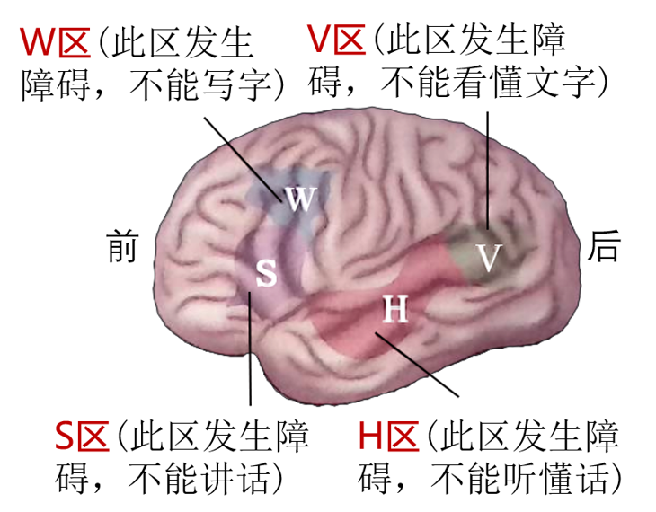

!!! quote "「引言」"
    大脑皮层有140亿神经元,有 感知外部世界/控制机体反射活动/语言/学习/记忆 等高级功能

## 语言功能 

!!! note ""
    听/说/读/写

!!! note inline end "图2-16 人大脑皮层的言语区(左半球)"
    

=== "左半球"

    - 语言功能
    - 逻辑思维

=== "右半球"

    - 形象思维: 音乐/绘画/空间识别

??? tip "大脑左右半球连接"
    胼胝体

## 学习与记忆

学习与记忆是指神经系统不断地刺激,获得新的 行为/习惯 和 积累经验 的过程.条件反射的建立也就是动物学习的过程

!!! note ""
    神经递质的作用 / 蛋白质合成

=== "学习"
    信息获取和加工的神经过程

=== "记忆"
    信息储存和读取的神经过程

!!! tip "特点"
    学习和记忆不是由**单一脑区**控制的，而是由 多个脑区 和 神经通路 参与

!!! note "记忆的过程"
    ``` mermaid
    graph LR
    A[外界信息输入] --> B["感觉性记忆"]
    subgraph s1 [短时记忆]
    B -- 注意 --> C["第一级记忆"]
    end
    C -- 运用 --> D["第二级记忆"]
    subgraph s2 [长时记忆]
    D -- 重复整合 --> E["第三级记忆"]
    end
    subgraph s3 [持续时间]
    B --- U["(<1s)"]
    C --- V["(数秒至一分钟)"]
    D --- W["(数分钟至数年)"]
    E --- X["(可能永久)"]
    end
    ```

## 情绪

人对外界做出的反应