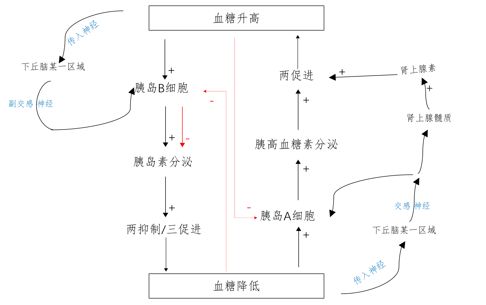

## 血糖平衡的调节

### 血糖

血液中的糖 (主要是葡萄糖)

### 血糖浓度

(正常人 / 空腹) $3.9\sim 6.1 \text{mmol}\cdot \text{L}^{-1}$

### 血糖的来源与去路

=== "血糖升高时调节 (胰岛素)"

    !!! info ""
        「两抑制 / 三促进」

=== "血糖降低时调节 (胰高血糖素)"

    !!! info ""
        「两促进 / 三抑制」

### 反馈调节

- 在一个系统中,系统本身工作的效果,反过来又作为信息调节该系统的工作

!!! abstract "分类"
    - 正反馈: 回归静态 (体温调节 / 血糖调节)
    - 负反馈: 偏离静态 (血液凝固 / 排尿排便 / 胎儿分娩)

### 小结

### 尿糖 糖尿病

!!! info "高血糖"
    空腹 $>6.1 \text{mmol}\cdot\text{L}^{-1}$

    餐后两小时 $>7.8 \text{mmol}\cdot\text{L}^{-1}$

!!! abstract "尿糖"
    - 一次性摄入糖过多
    - 糖尿病
    - 肾脏疾病,重吸收血糖能力下降
    !!! warning ""
        血糖浓度超出肾脏的重吸收能力,随尿排出

!!! tip "糖尿病"
    高血糖 / 尿糖 导致多器官功能损害
    !!! abstract "分类"
        === "1型"

            青少年多发,胰岛素 功能减退 / 分泌减少

        === "2型"

            与 遗传 / 环境 / 生活方式 相关,机体组织细胞对胰岛素敏感度降低
    !!! bug "症状"
        「三多一少」(多饮/多食/多尿/体重减少)
    
## 甲状腺激素分泌的分级调节

!!! info "分级调节"

    下丘脑 / 垂体 / 靶腺体 之间存在的一种分层调控

    !!! abstract "类型"
        下丘脑 - 垂体 - ×× 轴
    !!! tip "意义"
        可以放大激素的调节效应,形成多级反馈,有利于**精细调控**,从而**维持机体的稳态**

## 激素调节的特点

- 通过体液进行运输
??? warning "注意"
    不能定向运输
- 作用于靶器官 / 靶细胞
- 作为信使传递信息
??? info "一般来说"
    蛋白质等大分子受体在细胞膜上,小分子受体在细胞膜内
- 微量和高效

### 协同作用

不同激素对同一生理效应起**增强效应**的作用

### 抗衡作用

不同激素对同一生理效应发挥相反的作用