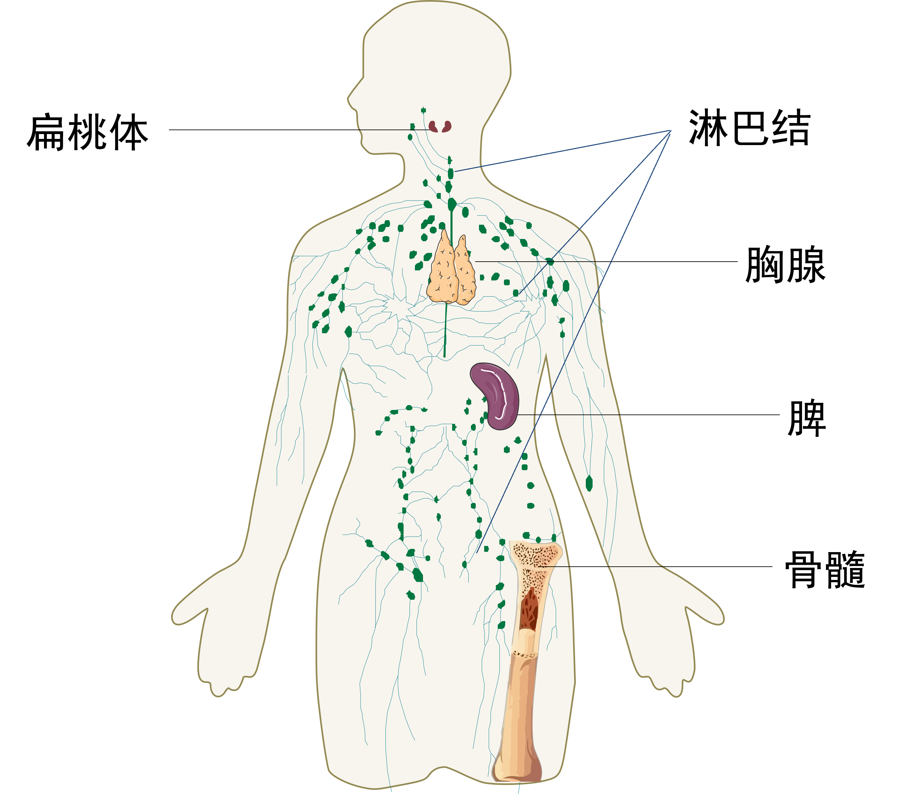
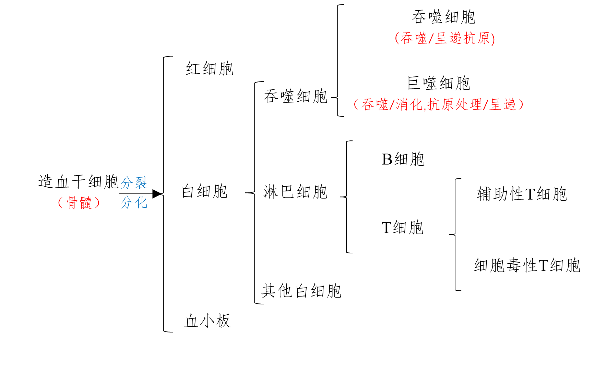

## 免疫系统的组成

### 免疫器官

#### 定义

免疫细胞 生成/成熟/集中分布 的场所

#### 组成

??? note "*图4-1 人体内免疫器官*"
    

=== "骨髓"

    - 位于骨髓腔或骨松质内,是各种免疫细胞 发生/分化/发育 的场所,是机体重要的免疫器官

=== "胸腺"

    - 位于胸骨的后面,呈扁平的椭圆形,分左/右两叶
    - 随年龄而增长,在青春期时达到高峰,以后逐渐退化
    - T 细胞 分化/发育/成熟的场所

=== "脾"

    - 椭圆形,在胃的左侧,内含大量的淋巴细胞
    - 参与制造新的血细胞,清除衰老的血细胞等

=== "扁桃体"

    - 通常指咽腭部的扁桃体,左右各一,形状像扁桃
    - 内部有很多免疫细胞,具有防御功能

=== "淋巴结"

    - 呈圆形或豆状,淋巴细胞集中
    - 沿淋巴管遍布全身,集中在 颈部/腋窝部/腹股沟部 等处
    - 阻止/消灭侵入体内的微生物

### 免疫细胞

#### 定义

发挥免疫作用的细胞

#### 组成

### 免疫活性物质

#### 定义

由免疫细胞或其他细胞产生的发挥免疫作用的物质

#### 组成

=== "抗体"

    !!! tip ""
        机体产生的专门应对抗原的蛋白质,称为抗体
    - 本质: 蛋白质
    - 分布: 
        * 血清(主要)
        * 组织液及外分泌液(如乳汁中,为新生儿提供抗体)

    !!! warning ""
        一种抗体只能与一种抗原结合

=== "细胞因子"

    !!! tip ""
        由多种细胞,特别是免疫细胞产生的一类具有多种生物学活性的**小分子多肽**或**糖蛋白**

    - 功能: 细胞间相互联络/协调免疫应答的联络"信号"等
    - 分类: 
        * 淋巴因子: 淋巴细胞产生的细胞因子
        * 单核因子: 单核/巨噬细胞产生的细胞因子
    - 常见种类: 白细胞介素/干扰素/肿瘤坏死因子等

=== "溶菌酶"

    !!! tip ""
        广泛存在于 泪液/唾液/血浆等处 的一类蛋白质,能通过破坏多种细菌的细胞壁结构来杀死细菌

!!! info "抗原"
    - 概念: 能与免疫细胞表面的受体结合,从而引发免疫反应的(特定蛋白质等)物质
    - 作用方式: 与免疫细胞表面的受体结合,从而引发免疫反应
    - 本质: 大多数是蛋白质(还有多糖、脂类等)
    - 分布: 既可以游离,也可以存在于 细菌/病毒 等病原微生物以及细胞上

!!! tip "抗原呈递细胞(APC)"
    - 功能: 摄取/加工处理 抗原,将抗原信息暴露在细胞表面,呈递给其他免疫细胞
    - 分类: B细胞 / 树突状细胞 / 巨噬细胞

## 免疫系统的功能

