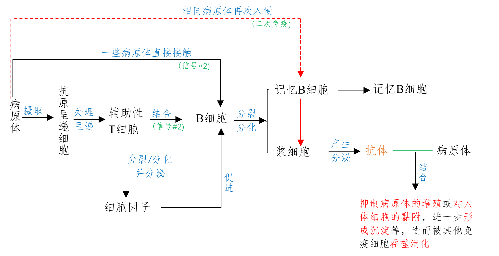
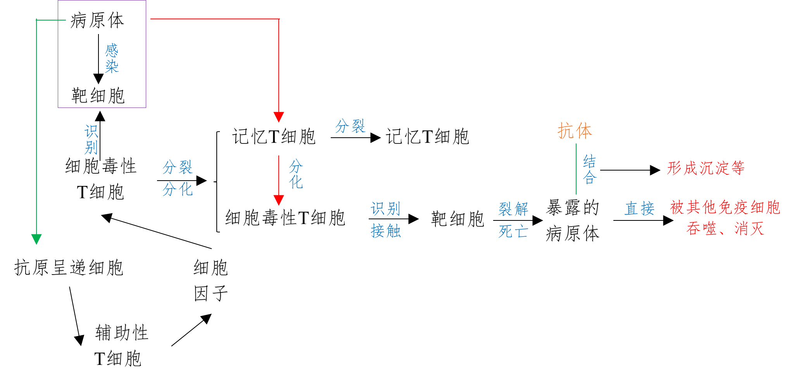
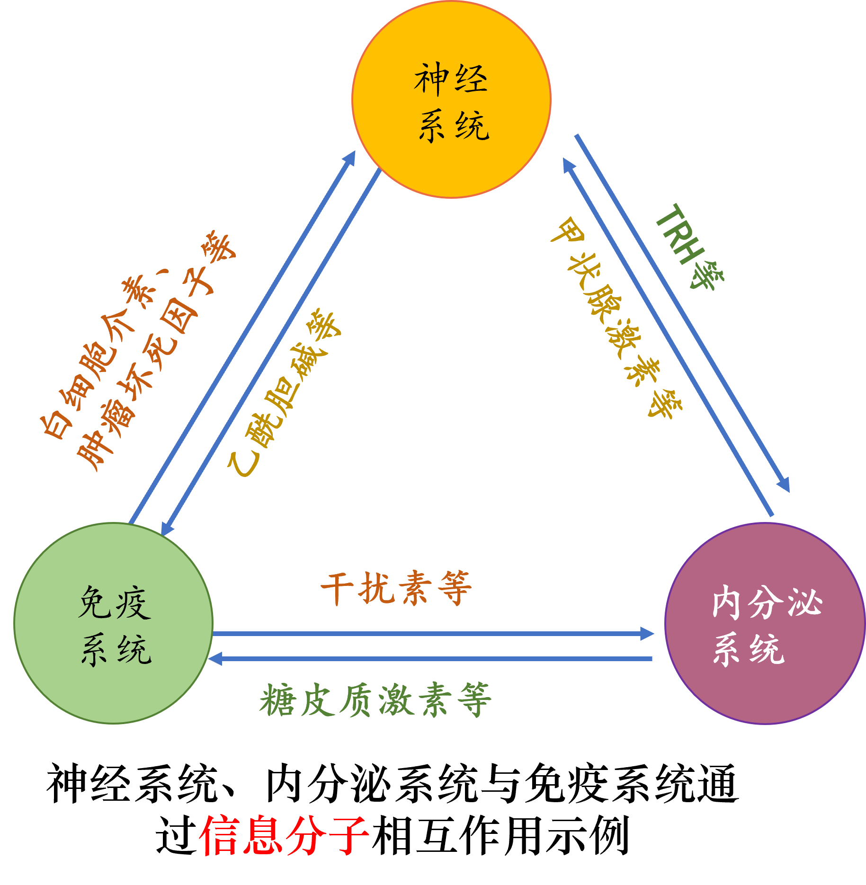

## 免疫系统对病原体的识别

!!! info "身份标签"
    细胞膜表面作为**分子标签**来起作用的一组**蛋白质**
    !!! note ""
        病毒 / 细菌 等病原体带有各自的身份标签

## 体液免疫

### 过程

### 二次免疫

相同病原体再次入侵,记忆细胞快速增殖分化,形成浆细胞,快速产生大量抗体

!!! tip "特点"

    - 反应快
    - 产生抗体更多
    - 作用强
    - 能在抗原入侵机体但未患病前消灭之,降低患病程度

??? note "一些问题"

    ??? question "参与体液免疫的细胞"
        抗原呈递细胞 / 辅助性T细胞 / B细胞 / 记忆B细胞 / 浆细胞

    ??? question "上述细胞能否识别抗原"
        === "能识别"
            抗原呈递细胞 / 辅助性T细胞 / B细胞 / 记忆B细胞
        === "不能识别"
            浆细胞

    ??? question "上述能识别抗原的细胞中是否具有特异性"
        === "有特异性"
            辅助性T细胞 / B细胞 / 记忆B细胞
        === "无特异性"
            抗原呈递细胞

    ??? question "激活B细胞的两个信号"
        1. 一些病原体和B细胞接触
        2. 辅助性T细胞表面的特定分子发生变化并与B细胞结合

    ??? question "B细胞活化的条件"
        1. 一些病原体和B细胞接触
        2. 辅助性T细胞表面的特定分子发生变化并与B细胞结合
        3. 细胞因子促进B细胞的分裂 / 分化过程

    ??? question "活化后的B细胞会如何变化"
        当B细胞活化后,就开始增殖 / 分化,大部分分化为浆细胞,小部分分化为记忆B细胞

    ??? question "抗体的作用"
        抑制病原体的增殖或对人体细胞的黏附,使病原体进一步形成沉淀等
    
    ??? question "体液免疫过程中,辅助性T细胞开始分裂 / 分化 / 分泌细胞因子的条件"
        1. 抗原呈递细胞将抗原处理后呈递在细胞表面,传递给辅助性T细胞
        2. 辅助性T细胞表面的特定分子发生变化并与B细胞结合

    ??? question "体液免疫过程中，辅助性T细胞的作用"
        1. 识别(APC处理后呈递在细胞表面的)抗原
        2. 激活B细胞
        3. 分泌细胞因子

    ??? question "体液免疫过程中细胞因子的作用"
        促进B细胞的分裂 / 分化过程

    ??? question "体液免疫过程中能增殖分化的细胞"
        B细胞 / 辅助性T细胞 / 记忆B细胞

    ??? question "浆细胞是否具有分裂 / 分化能力"
        否(浆细胞是高度分化的细胞,不再分裂 / 分化,无细胞周期)

    ??? question "浆细胞中较发达的细胞器"
        核糖体 / 内质网 / 高尔基体 / 线粒体

    ??? question "记忆B细胞能否产生抗体"
        否(记忆B细胞增殖分化后形成大量浆细胞,浆细胞产生和分泌大量抗体,**能产生和分泷抗体的细胞只有浆细胞**)

## 细胞免疫

### 概念

病原体进入细胞内部,T细胞直接接触靶细胞来“作战”

### 针对的对象

- 被病原体侵染的靶细胞
- 衰老损伤的细胞 / 癌细胞
- 异体器官移植细胞

### 过程

??? note "一些问题"

    ??? info "靶细胞"
        被病原体感染的宿主细胞
    
    ??? question "靶细胞能被细胞毒性T细胞识别的原因"
        靶细胞膜表面的某些分子发生变化,细胞毒性T细胞(有相关受体)能识别变化的信号

    ??? question "细胞毒性T细胞活化的条件"
        1. 细胞毒性T细胞识别靶细胞膜表面的某些分子变化(抗原刺激)
        2. 辅助性T细胞分泌细胞因子促进细胞毒性T细胞的分裂和分化

    ??? question "活化后的细胞毒性T细胞如何变化"
        分裂并分化成新的细胞毒性T细胞和记忆T细胞

    ??? question "新产生的活化的细胞毒性T细胞的作用"
        识别 / 接触 / 裂解 被同样病原体感染的靶细胞

    ??? question "靶细胞裂解后病原体的去向"
        被抗体结合或直接被其他免疫细胞(如巨噬细胞)吞噬 / 消灭

    ??? question "病原体被消灭后活化的免疫细胞的去向"
        病原体被消灭后活化的免疫细胞的功能受到抑制

    ??? question "细胞免疫能否将抗原彻底消灭"
        否(细胞免疫的结果是使靶细胞裂解死亡,释放到体液中的抗原最终需要由体液免疫和吞噬细胞等来清除)

    ??? question "细胞免疫中记忆T细胞有什么作用"
        如果再次遇到相同的抗原，记忆T细胞会立即分化为细胞毒性T细胞， 迅速、高效地产生免疫反应。

    ??? question "初次免疫与二次免疫的机体内细胞毒性T细胞的来源"
        1. 初次免疫来源为细胞毒性T细胞
        2. 二次免疫来源为细胞毒性T细胞和记忆T细胞

    ??? question "细胞因子在整个特异性免疫过程中的作用"
        促进B细胞和细胞毒性T细胞的分裂和分化

    ??? question "辅助性T细胞在整个特异性免疫中的作用"
        **辅助性T细胞既参与体液免疫又参与细胞免疫**
        1. 在体液免疫中,辅助性T细胞 识别抗原 / 激活B细胞 / 分泌细胞因子
        2. 在细胞免疫中,辅助性T细胞分泌细胞因子

## 体液免疫和细胞免疫的协调配合

### 体液免疫和细胞免疫的关系

1. **B细胞**和**细胞毒性T细胞**的活化离不开**辅助性T细胞**的辅助,可见辅助性T细胞在体液免疫和细胞免疫中都起到关键作用;
2. 体液免疫中产生的抗体,能消灭**细胞外液**中的病原体;而消灭侵入细胞内的病原体,要靠细胞免疫中的**细胞毒性T细胞**将靶细胞裂解,将病原体释放出来,再由体液免疫中的抗体发挥作用;
3. 体液免疫和细胞免疫 **巧妙配合 / 密切合作**,共同完成对机体**稳态**的调节。

### 神经系统 / 内分泌系统 / 免疫系统 之间相互调节

!!! note inline end ""
    

1. 神经系统 / 内分泌系统 / 免疫系统 之间存在着相互调节,通过信息分子构成一个复杂网络.这三个系统各自以特有的方式在**内环境稳态**的维持中发挥作用,它们之间谁都不能取代另外两方.
2. 神经调节 / 体液调节 / 免疫调节 的实现都离不开**信号分子**(神经递质 / 激素 / 细胞因子 等).这些信号分子的作用方式,都是直接与**受体**接触.
3. 受体一般是**蛋白质**分子,不同受体的结构各异,因此信号分子与受体的结合具有**特异性**.

