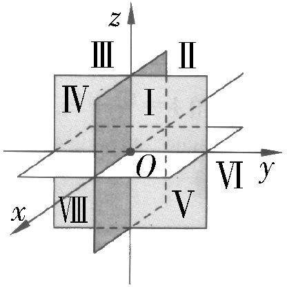

# 1.1 空间向量及其运算

## 1.1.1 空间向量及其运算

### 空间向量

- 空间中, 既有大小,又有方向 的量

??? note "一些历史概念"
    单位向量 / 零向量 / 相等向量 / 相反向量

### 位置关系

- 共面: 空间中多个向量,平移后在同一平面内,则它们共面

!!! tip "提示"
    任意两个空间向量共面

### 加法 / 减法 运算

- 「三角形法则」
- 「平行四边形法则」

- 交换律: $\vec{a}+\vec{b}=\vec{b}+\vec{a}$
- 结合律: $(\vec{a}+\vec{b})+\vec{c}=\vec{a}+(\vec{b}+\vec{c})$

### 数乘运算

- $\vec{b}=\lambda \vec{a} \Longrightarrow \vec{a} /\!/ \vec{b}$
- $\overrightarrow{AB} = \lambda \overrightarrow{AC} \Longrightarrow A,B,C \text{共线}$
- $\lambda (\vec{a}+\vec{b})=\lambda\vec{a}+\lambda\vec{b}$
- $(\lambda+\mu)\vec{a}=\lambda\vec{a}+\mu\vec{a}$

### 数量积

$$
\vec{a}\cdot \vec{b}=\mid\vec{a}\mid \cdot \mid\vec{b}\mid\cdot\cos<\vec{a},\vec{b}>
$$

!!! note "投影"

    空间向量 $\vec{a}$ ,空间中 直线 $l$ 或 平面 $\alpha$ ,过 $\vec{a}$ 的始点作 直线 $l$ 或 平面 $\alpha$ 的垂线,设垂足 $A,B$ , $\overrightarrow{AB}$ 是 $\vec{a}$ 在 直线 $l$ 或 平面 $\alpha$ 上的投影

!!! info "性质"

    - $\vec{a}\perp\vec{b}\Longleftrightarrow\vec{a}\cdot\vec{b}=0$
    - $(\lambda\vec{a})\cdot\vec{b}=\lambda\vec{a}\cdot\vec{b}$
    - $\vec{a}\cdot\vec{a}=\vec{a}^2=\mid\vec{a}\mid^2$
    - $\vec{a}\cdot\vec{b}=\vec{b}\cdot\vec{a}$
    - $\mid\vec{a}\cdot\vec{b}\mid<\mid\vec{a}\mid\cdot\mid\vec{b}\mid$
    - $(\vec{a}+\vec{b})\cdot\vec{c}=\vec{a}\cdot\vec{c}+\vec{b}\cdot\vec{c}$

## 1.1.2 空间向量基本定理

### 共面向量基本定理

若 $\vec{a},\vec{b}$ 不共线, $\vec{a},\vec{b},\vec{c}$ 共面 $\Longleftrightarrow$ 存在唯一 $(x,y)$ 使 $\vec{c}=x\vec{a}+y\vec{b}$

!!! info "推论"
    - 不共线三点 $A,B,C$ , $P$ 在平面 $ABC$ 内 $\Longleftrightarrow$ 存在唯一 $(x,y)$ 使 $\overrightarrow{AP}=x\overrightarrow{AB}+y\overrightarrow{AC}$
    - 空间中任意一点 $O$ , $\overrightarrow{OP}=\alpha\overrightarrow{OA}+\beta\overrightarrow{OB}+\gamma\overrightarrow{OC}\Longleftrightarrow A,B,C,P$ 四点共面,且 $\alpha+\beta+\gamma=1$

### 空间向量基本定理

若空间中三个向量 $\vec{a},\vec{b},\vec{c}$ ,则对于任意向量 $\vec{p}$ ,都存在唯一 $\{x,y,z\}$ ,使 $\vec{p}=x\vec{a}+y\vec{b}+z\vec{c}$

## 1.1.3 空间向量的坐标 与 空间直角坐标系

### 空间向量的坐标

一般的,若一组基底 $\{\vec{e_1},\vec{e_2},\vec{e_3}\}$ 中, $\vec{e_1},\vec{e_2},\vec{e_3}$ 均为**单位向量**,且**两两垂直**,就称这组基底为**正交基底**,在单位正交基底下向量的分解称为向量的**单位正交分解**

!!! note "注"
    $$
    \vec{p}=x\vec{e_1}+y\vec{e_2}+z\vec{e_3}\Longleftrightarrow\vec{p}=(x,y,z)
    $$

!!! info "空间向量的运算 与 坐标的关系"

    !!! tip ""
        $\vec{a}=(x_1,y_1,z_1);\vec{b}=(x_2,y_2,z_2)$
    - $\vec{a}\pm\vec{b}=(x_1\pm x_2,y_1\pm y_2,z_1\pm z_2)$
    - $\vec{a}\cdot\vec{b}=x_1x_2+y_1y_2+z_1z_2$
    - $\lambda\vec{a}=(\lambda x_1,\lambda y_1,\lambda z_1)$
    - $\lambda\vec{a}+\mu\vec{b}=(\lambda x_1+\mu x_2,\lambda y_1+\mu y_2,\lambda z_1+\mu z_2)$
    - $\mid\vec{a}\mid=\sqrt{x_1^2+y_1^2+z_1^2}$
    - $\cos <\vec{a},\vec{b}>=\dfrac{\vec{a}\cdot\vec{b}}{\mid\vec{a}\mid\cdot\mid\vec{b}\mid}=\cdots$

!!! tip "空间向量的坐标 与 空间向量的 平行 / 垂直"

    - $\vec{a}/\!/\vec{b}\Longleftrightarrow\dfrac{x_1}{x_2}=\dfrac{y_1}{y_2}=\dfrac{z_1}{z_2}$
    - $\vec{a}\perp\vec{b}\Longleftrightarrow x_1x_2+y_1y_2+z_1z_2=0$

### 空间直角坐标系

在平面直角坐标系 $xOy$ 的基础上,过再作一条数轴 $z$ ,使之与 $x,y$ 轴都垂直

!!! abstract inline end "卦限"

    { width="300" }

??? failure "如何标点"
    先写轴,再写面,最后写空间,其余要计算

!!! info "两点间距离"
    $$
    \mid AB \mid = \sqrt{(x_1-x_2)^2+(y_1-y_2)^2+(z_1-z_2)^2}
    $$

!!! info "中点坐标"
    $$
    M(\dfrac{x_1+x_2}{2},\dfrac{y_1+y_2}{2},\dfrac{z_1+z_2}{2})
    $$
